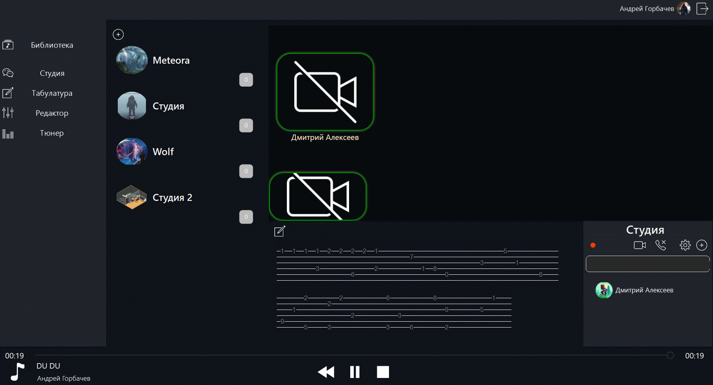

# MusicApp

Для записи музыкальных композиций людям приходится задействовать множество средств, например, для записи одного музыкального инструмента необходимо использовать специальную программу, чтобы поделится композицией с музыкальным сообществом приходится выполнить множество действий для публикации на определенных ресурсах, и главное – нет возможности совместно с друзьями попробовать исполнить свою или существующую музыку.

Данный сервис объединяет и включает в себя онлайн запись, сведение, обработка и хранение, а также передачи, дорожек и композиций другим пользователям, которые принимают участие в создании музыки.

## Демонстрация работы сервиса

### 1. Создание новой студии

  

### 2. Запись и настройка музыкальных композиций

  

### 3. Прослушивание записанных композиций и дорожек

  

### 4. Редактирование записанных музыкальных композиций

  

## Стек используемых технологий

- JavaScript
- Visual Studio
- C++/CLI
- WebRTC
